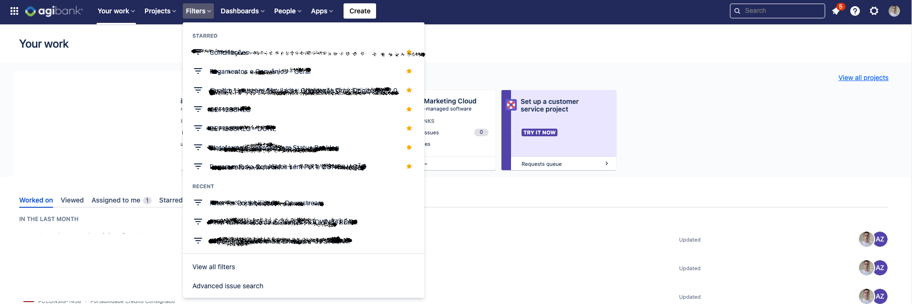

## jira-agile-metrics

Essa é uma ferramenta pensada para ajudar pessoas entusiastas sobre métricas ágeis de desenvolvimento de software, foi identificado que no dia a dia, nós que fazemos parte do eco-sistema de desenvolvimento de software e utilizamos a ferramenta JIRA, sempre temos algumas dificuldades de acesso a informações consolidadas de forma prática e gratuita, pensando nisso, visamos facilitar suas analises e apresentações, abstraindo a complexidade burocrática e apoiando na geração de gráfico úteis,

## **Funções habilitadas na ferramenta**

- Extração de planilha com gráfico detalhado de leadtime.
- Extração de planilha com gráfico detalhado de throughput.

## **Passo a passo**

- Abra a ferramenta Jira e selecione filtros avançados conforme na imagem

- Selecione a dropdown de Columns(Colunas) conforme imagem abaixo

**Na dropdown selecione todos os itens listados abaixo**

-Created
-Issue Type
-Key
-Labels
-Project
-Start date
-Status
-Updated

- Coloque um filtro na busca pelos dados do projetos que vocês gostaria de exportar os dados, conforme imagem abaixo.

-Após pesquisar os dados do projeto, clique no icone para exportar os dados para excel, conforme imagem abaixo.

- Quando aparecer o pop-up perguntando se você permite(allow), clique em permitir a exportação dos dados, conforme imagem abaixo.

-No próximo pop-up, clique em excel no desktop e o arquivo vai ser baixado na pasta downloads, conforme imagem abaixo.

- Após esse processo, acesso a url: 

[Jira Agile Metrics](https://jira-agile-metrics-web.herokuapp.com/)

- Nomeie o arquivo no campo que aparece na tela
- Selecione o arquivo que você baixou do jira a
- Clique em enviar, faça esse processo com todos arquivos que você extraiu do jira e gostaria de exportar os gráficos pela ferramenta

- Após esse processo, é só clicar em gerar arquivos e aguardar
- Ao clicar em remover arquivos, os arquivos de entrada e saida da ferramentas serão removidos.

**Observações** 

A ferramenta está em sua fase de testes, então você estará utilizando ao mesmo tempo que outros usuários, gerando assim em alguns momentos uma possível concorrência, devemos melhorar essa questão nas próximas versões.

Não nos responsabilizamos e nem armazenamos nenhum tipo de dados histórico sobre os dados que você inserir na ferramenta, pois nosso único intuito e tornar o seu dia melhor e mais fácil, e não nos apropriar dos seus dados, fique ciente que fazemos o que fazemos em prol da comunidade ágil de software.

